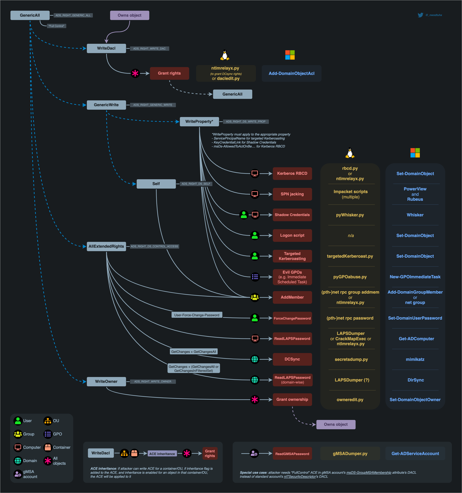

## Generic Access Rights Bits
|Display Name|Common Name|Hexadecimal Value|Interpretation|
|:--|:--|:--|:--|
|`GenericAll`|`GA`/`RIGHT_GENERIC_ALL`|`0x10000000`|Allows creating or deleting child objects, deleting a subtree, reading and writing properties, examining child objects and the object itself, adding and removing the object from the directory, and reading or writing with an `extended right`. This is equivalent to the `object-specific` access rights bits (`DE` \| `RC` \| `WD` \| `WO` \| `CC` \| `DC` \| `DT` \| `RP` \| `WP` \| `LC` \| `LO` \| `CR` \| `VW`) for AD objects.|
|`GenericExecute`|`GX`/`RIGHT_GENERIC_EXECUTE`|`0x20000000`|Allows reading permissions on and listing the contents of a container object. This is equivalent to the `object-specific` access rights bits (`RC` \| `LC`) for AD objects.|
|`GenericWrite`|`GW`/`RIGHT_GENERIC_WRITE`|`0x40000000`|Allows reading permissions on this object, writing all the properties on this object, and performing all validated writes to this object. This is equivalent to the `object-specific` access rights bits (`RC` \| `WP` \| `VW`) for AD objects.|
|`GenericRead`|`GR`/`RIGHT_GENERIC_READ`|`0x80000000`|Allows reading permissions on this object, reading all the properties on this object, listing this object name when the parent container is listed, and listing the object's contents if it is a [container](https://learn.microsoft.com/en-us/openspecs/windows_protocols/ms-adts/b645c125-a7da-4097-84a1-2fa7cea07714#gt_c3143e71-2ada-417e-83f4-3ef10eff2c56). This is equivalent to the `object-specific` access rights bits (`RC` \| `LC` \| `RP` \| `LO`) for AD objects.|


## Standard Access Rights Bits
|Display Name|Common Name|Hexadecimal Value|Interpretation|
|:--|:--|:--|:--|
|`WriteDacl`|`WD`/`RIGHT_WRITE_DAC`|`0x00040000`|Allows modifying the object's `security descriptor`'s `discretionary access-control list` (`DACL`).|
|`WriteOwner`|`WO`/`RIGHT_WRITE_OWNER`|`0x00080000`|Allows modifying the object's `security descriptor`'s `owner`. A user can only take ownership of an object but cannot transfer ownership of an object to other users.|
|`ReadControl`|`RC`/`RIGHT_READ_CONTROL`|`0x00020000`|Allows reading the data from the object's `security descriptor`, however, this does not include the data of the `SACL`.|
|`Delete`|`DE`/`RIGHT_DELETE`|`0x00010000`|Allows deleting the object.|


## Object-specific Access Rights Bits
| Common Name                             | Hexadecimal Value | Interpretation                                                                                                                                                                                                                                                                                                                                                                                                                                                                                                                                                                                   |
| :-------------------------------------- | :---------------- | :----------------------------------------------------------------------------------------------------------------------------------------------------------------------------------------------------------------------------------------------------------------------------------------------------------------------------------------------------------------------------------------------------------------------------------------------------------------------------------------------------------------------------------------------------------------------------------------------- |
| `CR`/`RIGHT_DS_CONTROL_ACCESS`          | `0x0000100`       | Allows performing an operation controlled by a [control access right](https://learn.microsoft.com/en-us/openspecs/windows_protocols/ms-adts/b645c125-a7da-4097-84a1-2fa7cea07714#gt_42f6c9e0-a2b3-4bc3-9b87-fdb902e5505e). The `ObjectType` member of an `ACE` can contain a `GUID` that identifies the `control access right`. If `ObjectType` does not contain a `GUID`, the `ACE` controls the right to perform all `control access right` controlled operations associated with the object. Also referred to as `AllExtendedRights`, especially when `ObjectType` does not contain a `GUID`. |
| `WP`/`RIGHT_DS_WRITE_PROPERTY`          | `0x00000020`      | Allows writing properties of the object. The `ObjectType` member of an `ACE` can contain a `GUID` that identifies a property set or an attribute. If `ObjectType` does not contain a `GUID`, the `ACE` controls the right to write `all` object's attributes.                                                                                                                                                                                                                                                                                                                                    |
| `VW`/`RIGHT_DS_WRITE_PROPERTY_EXTENDED` | `0x00000008`      | Allows performing an operation controlled by a [validated write](https://learn.microsoft.com/en-us/openspecs/windows_protocols/ms-adts/20504d60-43ec-458f-bc7a-754eb64446df) `access right`. The `ObjectType` member of an `ACE` can contain a `GUID` that identifies the `validated write`. If `ObjectType` does not contain a `GUID`, the `ACE` controls the rights to perform all `validated write` operations associated with the object. Also referred to as `Self`.                                                                                                                        |


## Extended (Object-specific) Access Rights
|Display Name|Common Name|Rights-GUID Value|Interpretation|
|:--|:--|:--|:--|
|[Reset Password](https://learn.microsoft.com/en-gb/windows/win32/adschema/r-user-force-change-password)|`User-Force-Change-Password`|`00299570-246d-11d0-a768-00aa006e0529`|Allows a user's account password to be reset without knowing the old one. This is in contrast to [User-Change-Password](https://learn.microsoft.com/en-gb/windows/win32/adschema/r-user-change-password), which does require knowing the old password.|
|[Replicating Directory Changes](https://learn.microsoft.com/en-gb/windows/win32/adschema/r-ds-replication-get-changes)|`DS-Replication-Get-Changes`|`1131f6aa-9c07-11d1-f79f-00c04fc2dcd2`|Required to replicate changes from a given `NC` (`Naming Context`). To perform a `DCSync` attack, this extended right and `DS-Replication-Get-Changes-All` are required.|
|[Replicating Directory Changes All](https://learn.microsoft.com/en-gb/windows/win32/adschema/r-ds-replication-get-changes-all)|`DS-Replication-Get-Changes-All`|`1131f6ad-9c07-11d1-f79f-00c04fc2dcd2`|Allows the replication of secret domain data. To perform a `DCSync` attack, this extended right and `DS-Replication-Get-Changes` are required.|


## Validated Writes
| Display Name                                                                                                          | Common Name       | Rights-GUID Value                      | Interpretation                                                                          |
| :-------------------------------------------------------------------------------------------------------------------- | :---------------- | :------------------------------------- | :-------------------------------------------------------------------------------------- |
| [Add/Remove self as member](https://learn.microsoft.com/en-gb/windows/win32/adschema/r-self-membership)               | `Self-Membership` | `bf9679c0-0de6-11d0-a285-00aa003049e2` | Allows editing the `member` attribute, therefore enabling setting membership of groups. |
| [Validated write to service principal name](https://learn.microsoft.com/en-gb/windows/win32/adschema/r-validated-spn) | `Validated-SPN`   | `f3a64788-5306-11d1-a9c5-0000f80367c1` | Allows editing the `Service Principal Name` (`SPN`) attribute.                          |


## Enumeration
To enumerate you can either use the fido "Bloodhound" and do it "graphically". Or you can also do it manually via Impacketer-script.
```shell-session
python3 examples/dacledit.py -principal pedro -target yolanda -dc-ip 10.129.205.81 inlanefreight.local/pedro:SecuringAD01
```
(This will show the ACL that Pedro has over Yolanda user.)


## Mind-map
Here is a small "attacks" mind-map that can be used to guide you thru some of the possible DACLs abuses.
