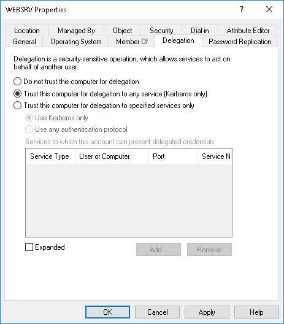
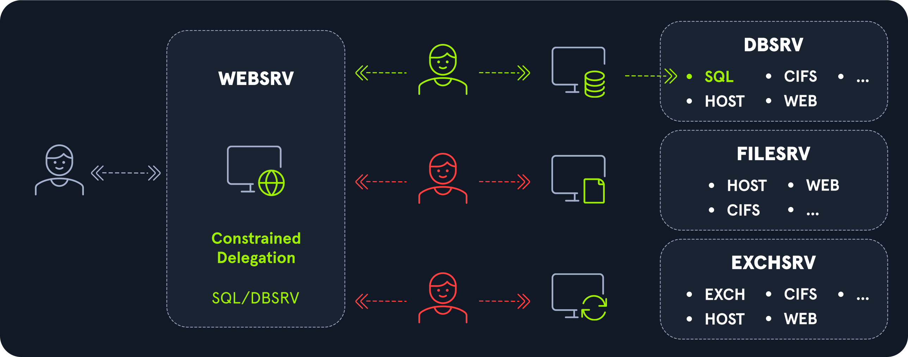
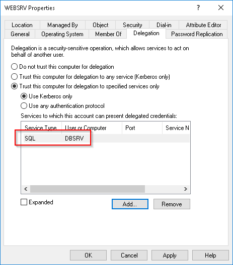
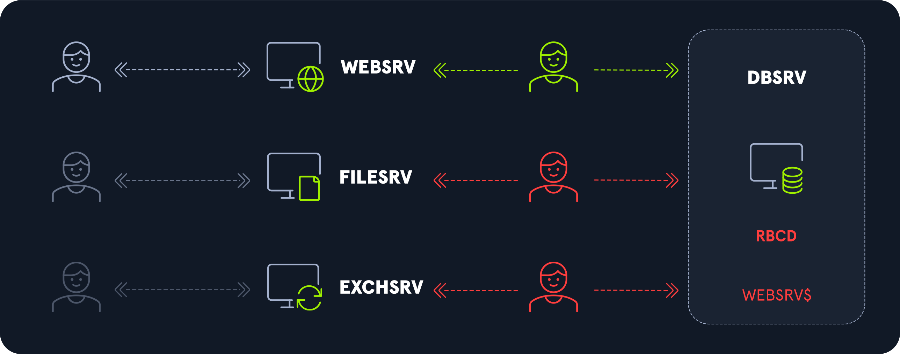
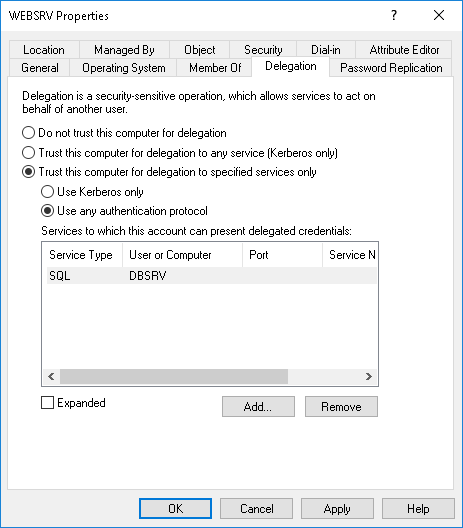

## What is?
The Kerberos protocol allows a user to authenticate to a service to use it, and Kerberos delegation enables that service to authenticate to another service as the original user. 
Kerberos delegation exists in three types: `unconstrained`, `constrained`, and `resource-based constrained`.


## Unconstrained Delegation

Unconstrained delegation allows a service, here `WEBSRV`, to impersonate a user when accessing `any other service`. This is a very permissive and dangerous privilege, therefore, not any user can grant it.
In AD the setting to setup this looks like this...

Specifically, when this option is enabled, the `TRUSTED_FOR_DELEGATION` flag is set on the account in the `User Account Control` (UAC) flags.
When this flag is set on a service account, and a user makes a TGS request to access this service, the `domain controller` will add a copy of the `user's TGT` to the `TGS ticket`. This way, the service account can extract this TGT, and thus make TGS requests to the Domain Controller `using a copy of the user's TGT`. The service will therefore have valid TGS ticket or Service Ticket (ST) `as the user` and will be able to access any services `as the user`.

## Constrained Delegation

This time, a service has the right to impersonate a user to a well-defined list of services. In this example, `WEBSRV` can only relay authentication to the `SQL/DBSRV` service but not to the others.
In AD the setting looks like this.

 If the service account, here `WEBSRV`, wishes to authenticate to a resource (`SQL/DBSRV`) on behalf of the user, it must make a special TGS request to the domain controller. Two fields will be modified compared to a classic TGS request.
- The `additional tickets` field will contain a copy of the TGS ticket or Service Ticket the user sent to the service.
- The `cname-in-addl-tkt` flag will be set to indicate to the Domain Controller that it should not use the server information but the ticket information in `additional tickets`, i.e., the user's information the server wants to impersonate.
The Domain Controller will then verify that the service has the right to delegate authentication to the requested resource and that the copy of the TGS ticket or Service Ticket is forwardable (which is the default but can be disabled if the `Account is sensitive and cannot be delegated` flag is set in the user's UAC flags).

## Resource-Based Constrained Delegation

Resource-based constrained delegation reverses the responsibilities and shifts delegation management to the final resource. Any account on this trusted list has the right to delegate authentication to access the resource. In this example, the trusted list of the account `DBSRV$` contains only the account `WEBSRV$`. Thus, a user will be authorized if `WEBSRV$` wishes to impersonate a user to access a service exposed by `DBSRV`. On the other hand, other accounts are not allowed to delegate authentication to any service provided by `DBSRV`.
Unlike the other two types of delegation, the resource has the right to modify its own trusted list. 
If a service account adds one or more accounts to its trusted list, it updates its `msDS-AllowedToActOnBehalfOfOtherIdentity` attribute in the directory.
### Adding permission to RBCD
In this example we allow WEBSRV to impersonate user to access resources oer DBSRV server.
```powershell-session
Import-Module ActiveDirectory
Set-ADComputer DBSRV -PrincipalsAllowedToDelegateToAccount (Get-ADComputer WEBSRV)
```

## S4U2Proxy
`S4U2Proxy` ([Service for User to Proxy](https://learn.microsoft.com/en-us/openspecs/windows_protocols/ms-sfu/bde93b0e-f3c9-4ddf-9f44-e1453be7af5a)) corresponds to the TGS request made by a service account to impersonate a user. The service account makes this TGS request to access a specific resource, and a copy of the user's TGS ticket is embedded in this request. The Domain Controller will then check that the service has the right to delegate authentication to the requested resource.

## S4U2Self
`S4U2Self` ([Service for User to Self](https://learn.microsoft.com/en-us/openspecs/windows_protocols/ms-sfu/02636893-7a1f-4357-af9a-b672e3e3de13)) extension allows a service to obtain a [forwardable](https://learn.microsoft.com/en-us/openspecs/windows_protocols/ms-sfu/4a624fb5-a078-4d30-8ad1-e9ab71e0bc47#gt_4c6cd79b-120d-4ee1-ab24-d1b000e0b3ca) TGS ticket to itself `on behalf of an arbitrary user`. Thus, when a user authenticates to the service via NTLM for example, the service will first request a forwardable TGS to itself on behalf of the user to act as if the user had authenticated via Kerberos, then once the service has this special TGS ticket, it can make its TGS request to use the desired resource (S4U2Proxy), embedding the brand new forwardable TGS ticket it just asked for.
<font color="#c00000">But what happens if a user has authenticated to the service without using Kerberos and therefore without providing a TGS ticket.</font>
In AD  if the `Use any authentication protocol` option is set, then the service account can use the `S4U2Self` extension and, therefore, can `create` a `TGS ticket` for an `arbitrary user`.


## Mindmap
